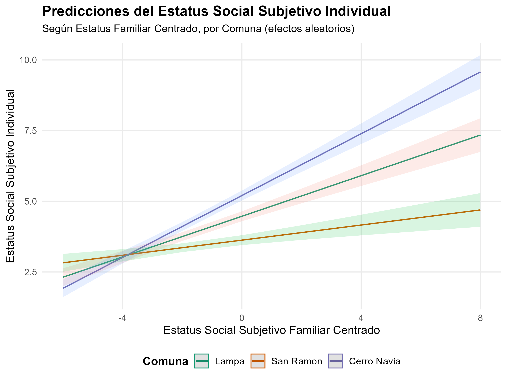
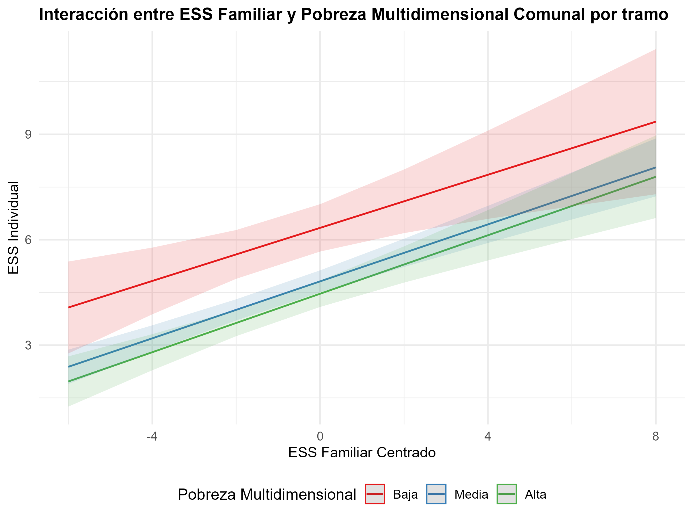

```{r librerias, echo=FALSE, warning=FALSE, message=FALSE}
library(pacman)
pacman::p_load(tidyverse,   
               sjPlot,      
               confintr,    
               gginference,  
               rempsyc,     
               broom,       
               sjmisc,       
               knitr,
               lme4,
               reghelper,
               haven,
               stargazer,
               ggplot2, 
               texreg, 
               dplyr,
               summarytools,
               gt,
               tibble,
               sjlabelled, 
               here)            
pacman::p_load(tidyverse,sjPlot,confintr,gginference,rempsyc,broom,sjmisc,lme4,
               reghelper,haven,stargazer,ggplot2,texreg,dplyr,knitr,summarytools,Publish,
               corrplot,readxl,ggfortify,sjlabelled,lmtest,sandwich,
               foreign, lattice, ggeffects, car, lme4, lmerTest, influence.ME, tidyr )  

options(scipen = 999) # para desactivar notacion cientifica
rm(list = ls()) # para limpiar el entorno de trabajo
```

```{r datos, echo=FALSE, warning=FALSE, message=FALSE, results='hide'}

data <- readRDS("output/data_proc.Rdata")

# Modelo multinivel: Modelo nulo -------------------------------------------------------

agg_data=data %>% group_by(cod_com) %>% summarise_all(funs(mean)) %>% as.data.frame()

model0 = lmer(ess ~ 1 + (1 | cod_com), data = data)

ICC<-reghelper::ICC(model0)
ICC*100

#Modelo 1: Predictores de nivel individual -------------------------------

model1 = lmer(ess ~ 1 + ess_f_cmc  + edu_univ + ing_cmc + (1 | cod_com), data = data)

# Modelo 2: Predictores nivel 2 -------------------------------------------

model2 = lmer(ess ~ 1 + pob_tramo+  dim_seg_gmc  + dim_amb_gmc +  (1 | cod_com), data = data)

# Modelo 3: Predictores individuales y grupales ---------------------------

model3 = lmer(ess ~ 1 + ess_f_cmc  + edu_univ  + ing_cmc + pob_tramo + dim_seg_gmc  + dim_amb_gmc + (1 | cod_com), data = data)

#Modelo 4: Pendiente aleatoria -------------------------------------------

model4= lmer(ess ~ 1 + ess_f_cmc  + edu_univ + ing_cmc + pob_tramo + dim_seg_gmc  + dim_amb_gmc + (1 + ess_f_cmc| cod_com), data = data)

# Modelo 5: Interacción entre niveles -------------------------------------

model5 = lmer(ess ~ 1 + ess_f_cmc  + edu_univ + ing_cmc + ess_f_cmc*pob_tramo  + dim_seg_gmc  + dim_amb_gmc + tramo_edad + sexo + (1 + ess_f_cmc| cod_com), data = data)

```

# Abstract

# Introducción

El estudio de la desigualdad social ha sido uno de los temas fundacionales de la sociología, particularmente a través del análisis de los procesos de diferenciación y jerarquización de los grupos sociales. En este contexto, los enfoques clásicos —representados por Marx, Weber y la escuela funcionalista— introdujeron conceptos y nociones clave para comprender la estratificación social. Desde la perspectiva marxista, las clases sociales se definen por la posición que los sujetos ocupan en el proceso productivo. Para Weber, la clase está determinada por la posición que se tiene en el mercado del trabajo. Mientras que en el funcionalismo, los roles ocupacionales se jerarquizan en función de su valor funcional para el sistema social (Sémbler, 2006). A pesar de las diferencias teóricas, estos enfoques conceden un rol central al trabajo en la constitución de las identidades sociales y en los procesos de diferenciación, en el que la estructura ocupacional y la inserción en el mundo laboral juegan un rol clave en la conformación de la jerarquía social (Sémbler, 2006).

En este sentido, el concepto de estatus social es uno de los elementos esenciales de la estratificación social (Marqués Perales, I., & Rodríguez de la Fuente, J, 2023), entendido como la posición de superioridad, igualdad, o inferioridad que reflejan las evaluaciones prevalecientes de valor social (Budoki y Goldthorpe, 2013). En su dimensión objetiva, el estatus suele ser operacionalizado a partir de variables como el ingreso o el nivel educativo, o a partir de sistemas de clasificación de diferentes profesiones (Castillo et al., 2013). Desde su dimensión subjetiva, el estatus puede comprenderse como “la creencia de una persona acerca de su ubicación en un orden de estatus” (Davis, 1956, p.154, citado en Castillo et al., 2013).

A pesar de que ambas dimensiones no son excluyentes, sino que más bien son complementarias, la investigación sociológica se ha centrado en el estudio de la dimensión objetiva, dejando en segundo plano la dimensión subjetiva, especialmente en contextos latinoamericanos (Iturra & Mellado, 2018). Sin embargo, en la década de 1960, Germani (2010) aborda esta relación entre lo objetivo y lo subjetivo en un estudio sobre estratificación y movilidad social en Buenos Aires. Donde se destaca que las personas tienden a ubicarse subjetivamente en una posición más coherente con su estatus objetivo cuando pertenecen a los extremos del sistema de estratificación, es decir, los sectores más acomodados o los más desfavorecidos. En cambio, entre los sectores medios, la identificación subjetiva se vuelve más compleja, pues entran en juego con mayor intensidad factores personales y situaciones particulares del entorno inmediato, o en otras palabras, existe una menor claridad estructural y en cambio, los elementos individuales y contextuales tienen un mayor peso.

Siguiendo por esta línea, el estudio de Penfold y Guzmán (2014) subraya que en América Latina existe una desconexión significativa entre la posición objetiva y la percepción subjetiva de clase, observándose un fenómeno de sobreposicionamiento de individuos de clases bajas dentro de la categoría de clase media. Por otra parte, Iturra y Mellado (2018), en un estudio comparativo de Chile, Argentina y Venezuela, concluyeron que, aunque los ingresos y el nivel educativo son predictores importantes del estatus social subjetivo, el factor individual que más incide en la autopercepción de la posición social es el estatus social subjetivo de la familia de origen.

No obstante, comprender el estatus subjetivo requiere también considerar los factores contextuales, especialmente en entornos urbanos profundamente desiguales como Santiago. Esta ciudad presenta altos niveles de segregación socioespacial, que no solo se expresa en desigualdades estructurales, sino que también las reproduce activamente (Rodríguez y Arriagada, 2004; Matto et al., 2014; Kaztman y Retamoso, 2005). Esta no sólo afecta el acceso a oportunidades educativas, laborales y de servicio (Sabatini y Wormald, 2013), sino que también moldea experiencias de estigmatización, inseguridad y desarticulación social (Otero et al., 2016).

En este sentido, resulta pertinente examinar las condiciones estructurales a nivel comunal que configuran las oportunidades de vida. El estudio de Mac-Clure et al. (2024), señala la importancia que le otorgan las personas a su lugar de residencia al momento de posicionarse en clases sociales bajas o autodenominarse como “pobres”. Debido a esto, resulta pertinente profundizar en el concepto de pobreza.

La pobreza por ingreso ha disminuido considerablemente en los últimos años en Chile. En 2006 la cifra alcanzaba el 28,7%, pasando a 13,9% en el 2013, y reduciendo a 6,5% para 2022 (Casen, 2023b). A pesar de esto, el concepto de pobreza se ha ampliado más allá de la dimensión económica. Desde inicios del siglo XXI se ha llegado a conceptualizar la pobreza tanto en aspectos económicos, sociales y culturales, enfatizando en diferencias por género, etnia y ubicación geográfica. Así, surge el Índice de Pobreza Multidimensional que se aplicó por primera vez en Chile en 2014, donde se mide Educación, Salud, Trabajo y Seguridad Social, y Vivienda; y a partir del año 2016, se incluye la dimensión de Redes y Cohesión social (PNUD, 2024).

En cuanto a cifras, al año 2022 se registra una pobreza multidimensional a nivel nacional de 16,9%, lo cual implica una disminución de 3,4% respecto al 20,3% registrado en 2017 (Casen, 2023a). De esta manera, tras comparar las cifras de los dos tipos de mediciones, resalta la necesidad de focalizar el estudio de la pobreza en diferentes dimensiones del bienestar.

El estudio del bienestar no se agota en tan solo en las dimensiones mencionadas. Durante los últimos años, la calidad de vida se ha asociado con las condiciones medioambientales del entorno (Benavides, 2011). Según Romero et al. (2010), estas condiciones se distribuyen desigualmente en las urbes. Por un lado, los sectores de mayores ingresos de Santiago, localizados en la zona oriente de la ciudad, cuentan con mayor cantidad de áreas verdes, así como calidad de aire. Mientras que, los sectores medios y bajos, viven en zonas de mayor densidad habitacional, bajos niveles de equipamiento comunal, escasez de espacios vegetados y expuestos a amenazas y vulnerabilidad medioambiental (Romero et al., 2010; Vázques y Salgado, 2009).

Santiago, al ser caracterizada por una ciudad altamente segregada, implica que las diferencias de ingresos, etarias o étnicas inciden sobre las desigualdad de las conductas delictivas. De esta manera, la concentración de delitos es desigual debido a los bienes, servicios urbanos y habitantes en cada territorio (Dammert y Oviedo, 2004). En este sentido, el delito opera como un símbolo cultural que expresa segregación espacial, condiciones de precariedad tanto físicas, como en el sistema de relaciones sociales, y el propio posicionamiento del estatus social (Saraví, 2004; Lupton, 1999 citado en Lunecke, 2016).

Por otro lado, Kelley y Evans (2004) en su teoría de “R & R-blend”, señalan que la percepción que tienen los sujetos sobre la estructura social es una combinación entre la realidad material y las generalizaciones, a partir de sus grupos de referencia–amigos, compañeros, familia—. A partir de esto, es posible estipular que el estatus social subjetivo de las personas, se verá afectado por la visión que tienen respecto a la posición de su familia (Iturra y Mellado 2018); lo cual, podrá verse modificado a partir de las condiciones materiales de sus entornos.

Así, se plantea que los barrios, como lugar de desarrollo de tejidos sociales y creación de experiencias de estigmatización e inseguridad, son condicionantes a la hora de posicionarse en la escala social (Saraví 2004, Otero et al., 2016). Por esta razón, es que el presente estudio utiliza a las comunas, entendidas como unidades administrativas intermedias, como una escala clave en el análisis de las condiciones del entorno que inciden en el fenómeno a explicar. Esta perspectiva permite examinar tanto los efectos directos del contexto como sus posibles interacciones con factores individuales, avanzando hacia una comprensión más integral del fenómeno.

Por ello, la presente investigación busca contribuir a la comprensión del estatus social subjetivo en la Región Metropolitana, mediante un modelo de análisis multinivel que permita identificar los factores individuales y contextuales asociados a esta autopercepción. A partir de los antecedentes y el problema planteado, surge la pregunta: ¿Qué factores individuales y comunales inciden en la autopercepción del estatus social subjetivo en la Región Metropolitana?

# Objetivos

**Objetivo general**

Analizar los factores individuales y contextuales asociados al estatus social subjetivo en la Región Metropolitana, mediante un modelo multinivel que permita estimar los efectos de las características personales y del entorno comunal en la autopercepción de posición social.

**Hipótesis**

Hipótesis de nivel 1:

-   H1: Las personas con educación universitaria o superior tendrán un mayor estatus social subjetivo, en comparación con aquellos que tienen un nivel educativo más bajo

-   H2: A mayores ingresos, mayor es el estatus social subjetivo

-   H3: Un mayor estatus social subjetivo familiar tiene un efecto positivo sobre el estatus social subjetivo

Hipótesis de nivel 2:

-   H4: Las comunas con un mayor índice de pobreza multidimensional tienen niveles más bajo de estatus social subjetivo

-   H5: Las comunas con una mayor tasa en la dimensión ambiental tienen niveles más elevados de estatus social subjetivo

-   H6: Las comunas con una mayor tasa en la dimensión de seguridad tienen niveles más altos de estatus social subjetivo

Hipótesis de interacción:

-   H7: El efecto positivo del estatus social familiar sobre la autopercepción del estatus social subjetivo se reduce en aquellas comunas con un mayor índice de pobreza multidimensional

```{r hipotesis, echo=FALSE}

knitr::include_graphics(here::here("input", "img", "hipotesis_fig.png"))

```

# Datos

El presente estudio utiliza datos provenientes de la encuesta Estudio Longitudinal Social de Chile (ELSOC) desarrollada por el Centro de Estudios de Cohesión y Conflicto Social (COES), que tiene como principal objetivo constituirse como un “insumo empírico la comprensión de las creencias, actitudes y percepciones de los chilenos hacia las distintas dimensiones de la convivencia y el conflicto, y cómo éstas cambian a lo largo del tiempo” (COES, s.f., p. 3).

La encuesta es aplicada con una periodicidad anual, de la cual, se analizan los datos correspondientes a la sexta ola, realizada entre julio y octubre de 2022. La población está compuesta por hombres y mujeres entre 18 y 75 años de edad. El diseño muestral es probabilístico, estratificado, por conglomerados y multietápico (COES, s.f.).

Además, se integraron dos fuentes de datos adicionales para las variables de nivel 2, la primera proveniente del Observatorio Social del Ministerio de Desarrollo Social y Familia y brinda información comunal sobre el índice de pobreza multidimensional (SAE, 2022). Mientras que la segunda fuente corresponde a dos dimensiones de la Matriz de Bienestar Humano Territorial cuyo objetivo es caracterizar los territorios (manzanas, barrios, comunas o regiones) a partir de cinco dimensiones: accesibilidad, ambiental, socioeconómico, seguridad y desarrollo local. Esta matriz se construye con datos provenientes de diversas instituciones, como el Instituto Nacional de Estadísticas, Censo de Población y Vivienda 2017, Ministerio de Educación, Subsecretaría de Prevención del Delito, entre otros. Para este informe, se considerarán únicamente las dimensiones ambiental y de seguridad, ya que las otras dimensiones son consideradas dentro del índice de pobreza multidimensional (Matriz BHT, s.f).

En cuanto al número de casos, se trabajará con una muestra de 767 individuos, mientras que a nivel contextual, se consideran 42 comunas de la Región Metropolitana. Se excluyeron las comunas de Alhué, Buin, Calera de Tango, María Pinto, Melipilla, Pirque, San José de Maipo, San Pedro, Talagante y Tiltil, debido a la ausencia de datos en la encuesta ELSOC.

A continuacion se presenta la Tabla 1 con las variables a utilizar en este estudio.

```{r tbl-1, echo=FALSE, warning=FALSE, message=FALSE}

tabla <- tibble::tribble(
   ~Tipo, ~Variable, ~Operacionalización, 
  "Dependiente", 
  "Estatus social subjetivo", 
  "¿Dónde se ubicaría usted en la escala de estatus social?\n1 (Nivel más bajo) – 10 (Nivel más alto)",
  
  "Nivel 1", 
  "Educación universitaria", 
  "Variable categórica que identifica si una persona ha alcanzado educación universitaria o superior, donde 1 = sin educación universitaria y 2 = educación universitaria o superior",
  
  "",
  "Ingreso total por hogar", "Ingreso percibido en el hogar por cada $500.000",
  
  "",
  "Estatus social familiar", 
  "¿Dónde ubicaría a la familia en que creció en la escala de estatus social?\n1 (Nivel más bajo) – 10 (Nivel más alto)",
  
  "Nivel 2", 
  "Pobreza multidimensional", 
  "Índice compuesto por las siguientes dimensiones: educación (22.5%), salud (22.5%), trabajo (22.5%), vivienda y redes (22.5%) y cohesion social (10%). Fue procesada como una variable categórica de tres tramos: baja (0 - 0.1), media (0.1 - 0.2) y alta (0.2 - 1)", 
  
  "",
  "Ambiental",
  "Dimensión basada en la amplitud térmica anual y la cobertura vegetal",
  
  "",
  "Seguridad",
  "Dimensión construida a partir de los indicadores de seguridad que miden la incidencia de delitos graves y leves contra personas y la propiedad",
  
)

tabla %>%
  gt() %>%
  tab_header(
    title = md("**Tabla 1: Variables del estudio**")
  ) %>%
  cols_label(
    Tipo = "Nivel de análisis",
    Variable = "Variable",
    Operacionalización = "Operacionalización",
  ) %>%
  tab_style(
    style = cell_text(weight = "bold"),
    locations = cells_body(
      columns = Tipo,
      rows = Tipo != ""
    )
  ) %>%
  tab_options(
    table.font.size = px(13),
    row.striping.include_table_body = TRUE
  )

```

El estatus social subjetivo, que corresponde a la variable dependiente del estudio, presenta un promedio de 4,69, lo que indica una concentración de los datos hacia el centro de la escala en una posición intermedia. en una posicion media. Según la Tabla 2, el estatus social subjetivo familiar presenta un promedio ligeramente inferior, aunque igual se concentra en los valores medios de la escala. No obstante, esta variable presenta una mayor dispersión en comparación con el estatus individual, lo que sugiere una variabilidad más alta entre los casos. En cuanto al ingreso total del hogar es de \$955.749 con una alta desviación estándar, por lo tanto, la distribución es bastante dispersa y desigual.

En cuanto al ingreso total del hogar, el promedio es de \$955.749, acompañado de una alta desviación estándar, lo que refleja una distribución dispersa y desigual.

```{r dscr n1, echo=FALSE, warning=FALSE, message=FALSE}
data$edu_univ <- set_label(data$edu_univ, label = "Educación universitaria")  
data %>%  select (ess_f, edu_univ,inghogar_i) %>% 
  sjmisc::descr(.,
                                                                                                     show = c("label","range", "mean", "sd", "NA.prc", "n"))%>%
  kable(., digits =2, "markdown", caption = "Tabla 2: Estadísticos descriptivos de las variables individuales")

```

En la Tabla 3, se observa que el 18% de la población de las comunas analizadas se encuentra en situación de pobreza multidimensional, cifra superior al promedio nacional que es de un 16,9% (Casen, 2023a). Esto da cuenta que la situación en la Región Metropolitana está caracterizada por mayores niveles de vulnerabilidad en comparación con la situación país.

En cuanto a la dimensión ambiental, el promedio es de 0,32, lo que indica que las comunas presentan niveles relativamente bajos en los aspectos ambientales evaluados. Esto sugiere una calidad ambiental deficiente o limitada, considerando que la escala se sitúa entre 0 y 1.

Por otro lado, la dimensión de seguridad presenta un promedio bastante alto, de 0,81, con una desviación estándar de 0,10. Esto indica que, en general, las comunas presentan bajos niveles de delincuencia. Sin embargo, el rango de valores va desde 0,53 hasta 0,98, lo que indica una mayor amplitud en la distribución y, por tanto, desigualdad entre comunas respecto a este aspecto.

```{r dscr n2, echo=FALSE, warning=FALSE, message=FALSE}

data %>%
  select(comuna, pob_tramo, dim_amb, dim_seg) %>%
  distinct() %>%
  sjmisc::descr(., show = c("label","range", "mean", "sd", "NA.prc", "n")) %>%
  kable(digits = 2, format = "markdown", caption = "Tabla 3: Estadísticos descriptivos de las variables contextuales")
```

En este informe se estimaron cinco modelos multinivel con el objetivo de analizar la variación en la variable dependiente considerando tanto factores individuales como contextuales:

-   Modelo nulo

Modelo sin predictores, con el fin de identificar la proporción de varianza atribuible al nivel comunal, mediante el cálculo de la correlación intraclase.

$$
ess_{ij} = gamma*{00} + u*{0j} + r\_{ij}
$$

-   Modelo 1 - Nivel individual

En este modelo se incluyen los predictores de nivel individual, los cuales corresponden a: estatus social subjetivo familiar, educación universitaria o superior, e ingreso total del hogar (en centenas de mil CLP).

$$
ess_{ij} = \gamma_{00} + 
\gamma_{10} \text{educación universitaria} + 
\gamma_{10} \text{estatus social familiar} +  
\gamma_{10} \text{ingresos} + u_{0j} + r_{ij}
$$

-   Modelo 2 - Nivel contextual

En este modelo se incorporan solo los predictores de nivel contextual, correspondientes al índice de pobreza multidimensional, la dimensión ambiental y la dimensión de seguridad.

$$
    ess_{ij} = \gamma_{00} + 
    \gamma_{01} \text{pobreza mutidimensional} + 
    \gamma_{01} \text{dimension ambiental} + 
    \gamma_{01} \text{dimension seguridad} + u_{0j} + r_{ij}
$$

-   Modelo 3 - Individual y grupal

Este modelo incorpora todos los predictores de nivel individual y contextual con efecto fijo

$$
\begin{align*}
ess_{ij} &= \gamma_{00} 
+ \gamma_{10} \text{educación universitaria}_{ij} 
+ \gamma_{10} \text{estatus social familiar}_{ij} 
+ \gamma_{10} \text{ingresos}_{ij} \\
&+ \gamma_{01} \text{pobreza multidimensional}_{j} 
+ \gamma_{01} \text{dimensión ambiental}_{j} 
+ \gamma_{01} \text{dimensión seguridad}_{j} 
+ u_{0j} + r_{ij}
\end{align*}
$$

-   Modelo 4 - Pendiente aleatoria

Al modelo anterior se le incorpora un efecto aleatorio para la variable estatus social subjetivo familiar por comunas.

$$
\begin{align*}
ess_{ij} &= \gamma_{00} \\
&+ \gamma_{10} \text{estatus social familiar}_{ij} + \gamma_{10} \text{educación universitaria}_{ij} \\
&+ \gamma_{10} \text{ingreso}_{ij} + \gamma_{01} \text{pobreza multidimensional}_{j} \\
&+ \gamma_{01} \text{dimensión seguridad}_{j} + \gamma_{01} \text{dimensión ambiental}_{j} \\
&+ u_{0j} + u_{1j} \text{estatus social familiar}_{ij} + r_{ij}
\end{align*}
$$

-   Modelo 5 - Interacción entre niveles

Este modelo incorpora un efecto aleatorio de pendiente para la variable estatus social subjetivo familiar por comuna y su interacción con el índice de pobreza multidimensional

$$
\begin{align*}
ess_{ij} &= \gamma_{00} \\
&+ \gamma_{10} \, \text{estatus social familiar}_{ij} + \gamma_{10} \, \text{educación universitaria}_{ij} \\
&+ \gamma_{10} \, \text{ingreso}_{ij} + \gamma_{01} \, \text{pobreza multidimensional}_{j} \\
&+ \gamma_{01} \, \text{dimensión seguridad}_{j} + \gamma_{01} \, \text{dimensión ambiental}_{j} \\
&+ \gamma_{11} \, \text{estatus social familiar}_{ij} \,* \text{pobreza multidimensional}_{j} + u_{0j} \\
&+ u_{1j} \, \text{estatus social familiar}_{ij} + r_{ij}
\end{align*}
$$

# Resultados

A continuación se presenta la tabla con los resultados de los seis modelos estimados en esta investigación. Primero, se analiza el modelo sin predictores (modelo nulo), seguido por la incorporación de variables individuales y contextuales por separado y en conjunto, y finalizando con modelos que incluyen pendiente aleatoria e interacción entre niveles.

```{r model-com, echo=FALSE, warning=FALSE, message=FALSE}

tab_model(
  model0, model1, model2, model3, model4, model5,
  show.ci  = FALSE,
  show.se  = TRUE,
  p.style  = "stars",
  digits   = 3,
  dv.labels = c(
    "Nulo", "Individual", "Grupal", "Individual y Grupal", "Pendiente Aleatoria", "Interacción"
  ),
  file = NA         
)

```

El modelo nulo presenta un coeficiente de correlación intraclase de 0.21, lo que indica que un 21% de la varianza del estatus social subjetivo se explica por las diferencias entre las comunas, este resultado nos permite sustentar el uso de la metodología multinivel, dado que una proporción significativa de la variabilidad en la variable dependiente se encuentra en el nivel contextual.

Mediante el modelo nulo, podemos identificar el intercepto o el *𝛄00* que es de 4.7197, correspondiente al promedio general de la población.

En el modelo 1 que incluye las variables individuales, se puede observar que las tres son significativas y tienen un efecto positivo sobre el estatus social subjetivo. La variable que tiene mayor nivel predictivo es el estatus social familiar, donde por cada punto que aumenta esta variable, el estatus social subjetivo aumenta en 0.41 puntos. En el caso de las personas que tengan un nivel educacional universitario o superior, tendrán 0.33 puntos más en su autopercepción de estatus que quienes tienen niveles más bajos de educación, con una significancia estadistica del 95%. Luego, en la variable de ingreso total por hogar por cada \$500.000 el estatus social subjetivo aumentara en 0.090.

En cuanto al modelo 2, los efectos de la pobreza multidimensional son negativos y significativos al 99.9%. Por un lado, las comunas con un porcentaje de pobreza multidimensional alto presentan una disminución de 1.95 puntos en el estatus social subjetivo, en comparación a las comunas con pobreza multidimensional bajo. Mientras que las comunas de nivel medio, presentan una disminución de 1.60 del estatus social subjetivo.

Por otro lado, se observa que la dimensión ambiental y de seguridad no presentan una relación significativa en ninguno de los modelos. Podemos decir que xxx.

En el modelo 3, tras la inclusión de las variables individuales y contextuales, se observa que el Estatus Social Subjetivo Familiar y los Ingresos, controlados por las variables de nivel 2, mantienen su relación positiva y significativa. Sin embargo, la educación pierde su nivel de significancia del 95%. En cuanto a la pobreza multidimensional, es posible observar que sus categorías mantienen su efecto significativo, demostrando una leve disminución en sus coeficientes de regresión.

En el modelo 4, donde la variable de estatus social subjetivo familiar tiene pendiente aleatoria, es decir, su efecto puede variar por comuna. En cuantos  los coeficientes, estos estos mantienen los niveles de significancia del modelo 3, pero presenta un R condicional de 0.469, siendo el mejor modelo.

A partir del modelo con pendiente fija (modelo 3) y el modelo con pendiente aleatoria (modelo 4), se realizó un test de devianza, donde la diferencia entre ambos es estadísticamente significativa, por ende, se comprueba que el modelo 4 tiene un mejor ajuste. A partir de esto, es posible proceder con el modelo 5 donde se prueba la hipótesis de interacción entre variables.

```{r anova}

anova_comparacion <- anova(model3, model4) |> 
  as.data.frame()

anova_comparacion |> 
  gt() |> 
  tab_header(
    title = "Tabla 4: Comparación de modelos con pendiente fija y aleatoria"
  )
```

{fig-align="center"}

Finalmente, el modelo 5 presenta la interacción entre Estatus social subjetivo familiar y pobreza multidimensional comunal, controlando por las variables de sexo y tramo de edad. En primer lugar, se observa que la interacción entre las variables no genera ningún impacto sobre la variable dependiente. En segundo lugar, se observa que se mantienen los niveles de significancia del modelo 4. Por último, se aprecia que las personas jóvenes, presentan una disminución de 0.34 puntos de estatus social subjetivo, en comparación a los adultos, siendo significativa al 95%.

{fig-align="center"}

## Análisis de casos influyentes

En esta investigación se mantuvo el total de las comunas, ya que al calcular la Distancia de cook se determinó que no existen casos influyentes, que podrian haber alterado significativamente los resultados de los modelos.

```{r dcook, echo=TRUE, warning=FALSE, message=FALSE}
estex.m5 <- influence(model5, "cod_com") 
tabla_sig <- sigtest(estex.m5, test = -1.96)$ess_f_cmc[1:10, ]

tabla_sig |> 
  gt() |> 
  tab_header(
    title = "Tabla 5: Distancia de cook"
  )
```

# Conclusiones

# Referencias

Benavides, A. R. (2011). Calidad de vida, calidad ambiental y sustentabilidad como conceptos urbanos complemetarios. Fermentum. Revista Venezolana de Sociología y Antropología, 21(61), 176-207.

Bukodi, E., & Goldthorpe, J. H. (2013). Decomposing ‘social origins’: The effects of parents’ class, status, and education on the educational attainment of their children. European sociological review, 29(5), 1024-1039.c

Castillo, J. C., Miranda, D., & Madero-Cabib, I. (2013). Todos somos de clase media: Sobre el estatus social subjetivo en Chile. Latin American Research Review, 48(1).
<https://jc-castillo.com/documents/magister-facso-2020/castillo%20et%20al%202013%20todos%20somos%20de%20clase%20media.pdf> 

Centro de Estudios de Conflicto y Cohesión Social (COES). (s.f.). Manual metodológico ELSOC 2016–2022 disponible en <https://manual-metodologico-elsoc.netlify.app/> 

Dammert, L. & Oviedo, E. (2004). Delitos y violencia urbana en una ciudad segregada En C. de Mattos, M. E. Ducci, A. Rodríguez & G. Yáñez Warner (Eds.), Santiago en la globalización: ¿Una nueva ciudad? (pp. 273-294). Santiago: Ediciones SUR. En <http://www.sitiosur.cl/r.php?id=121>

División Observatorio Social Estimaciones de área pequeña a nivel comunal (SAE). (2022). Estimaciones Comunales de Pobreza por Ingresos y Multidimensional en base a

Casen 2022 disponible en https://observatorio.ministeriodesarrollosocial.gob.cl/pobreza-comunal-2022

Encuesta de Caracterización Socioeconómica Nacional (CASEN). (2023a). Resultado de pobreza multidimensional 2022 disponible en <https://observatorio.ministeriodesarrollosocial.gob.cl/encuesta-casen-2022>

Encuesta de Caracterización Socioeconómica Nacional (CASEN). (2023b). Resultado de pobreza por ingreso 2022 disponible en <https://observatorio.ministeriodesarrollosocial.gob.cl/encuesta-casen-2022>

Evans, M. D., & Kelley, J. (2004). Subjective social location: Data from 21 nations. International Journal of Public Opinion Research, 16(1), 3-38.

Germani, G. (2010), “Clase social subjetiva e indicadores objetivos de estratificación” en Mera, Carolina y Rebón, Julián (Eds.), Gino Germani. La sociedad en cuestión. Antología comentada. Buenos Aires, CLACSO.

Iturra, J. C., & Mellado, D. (2018). Estatus social subjetivo en tres países de América Latina: El caso de Argentina, Chile y Venezuela. Contenido, Cultura y Ciencias Sociales. <https://doi.org/10.31235/osf.io/yp3wm>

Kaztman, F., & Retamoso, A. (2005). Segregación espacial, empleo y pobreza en Montevideo. Revista de la CEPAL, 2005(85), 131-148. <https://doi.org/10.18356/93a498f9-es>

Layera, M. L. M., Otero, G., & Perret, V. (2020). Inseguridad percibida en los barrios de Santiago de Chile: la importancia del bienestar subjetivo. Dados, 63 (1). <https://www.scielo.br/j/dados/a/Vdkqpn9BCxHSYNXCZFz5LkB/?format=html&lang=es>

Lunecke, A. (2016). Inseguridad ciudadana y diferenciación social en el nivel microbarrial: El caso del sector Santo Tomás, Santiago de Chile. EURE (Santiago), 42(125), 109-129. <https://doi.org/10.4067/S0250-71612016000100005>

Mac-Clure, O., Barozet, E., & Aguilera, C. (2024). Definiendo su posición en tiempos de crisis: ¿clase social u otros atributos?. Estudios sociológicos, 42, e2401. Epub 24 de mayo de 2024.<https://doi.org/10.24201/es.2024v42.e2401>

Mattos, C., Fuentes, L., & Link, F. (2014). Tendencias recientes del crecimiento metropolitano en Santiago de Chile: ¿Hacia una nueva geografía urbana? Revista INVI, 29(81), 193-219. <https://doi.org/10.4067/S0718-83582014000200006>

Marqués Perales, I., & Rodríguez de la Fuente, J. (2023). Posicionamiento subjetivo y condición socioeconómica en América Latina (2006-2020): Una aproximación desde el análisis multinivel. Dados, 67(3), e20220070.

Otero,  G.,  Carranza,  R.,  Contreras,  D.  (2016).  Los  ‘efectos  del  barrio’  en  el  rendimiento  educacional de los niños en Chile: los efectos de la organización local, polarización y desigualdad. Serie  Documentos de Trabajo COES, Documento de trabajo N° 14, pp. 1 – 28. [https://www.researchgate.net/publication/305281825_Los\_'efectos_del_barrio'\_en_el_rendimiento_educacional_de_los_ninos_en_Chile_Los_efectos_de_la_organizacion_local_polarizacion_y_desigualdad]

Penfold, M., & Rodríguez Guzmán, G. (2014). N° 17 (English): The Growing but Vulnerable Middle Class in Latin America. Growth Patterns, Values and Preferences. Public Policy and Productive Transformation Series;N° 17/2014, Caracas: CAF. Retrieved from <https://scioteca.caf.com/handle/123456789/909> 

PNUD. (2024). Análisis de la Medida de Pobreza Multidimensional en Chile. Santiago, Chile: Programa de las Naciones Unidas para el Desarrollo. <https://www.undp.org/es/chile/publicaciones/analisis-de-la-medida-de-pobreza-multidimensional-en-chile>

Programa de las Naciones Unidas para el Desarrollo (2023). Medición de la Pobreza Multidimensional en Chile, Encuesta Casen 2022. <https://observatorio.ministeriodesarrollosocial.gob.cl/storage/docs/casen/2022/Informe%20IPM%20-%20PNUD%20-%20CASEN%202022.pdf> 

Rodríguez, J., & Arriagada, C. (2004). Segregación Residencial en la Ciudad Latinoamericana. EURE (Santiago), 30(89), 05-24. <https://doi.org/10.4067/S0250-71612004008900001>

Romero Aravena, H., Fuentes, C., & Smith, P. (2010). Ecología política de los riesgos naturales y de la contaminación ambiental en Santiago de Chile: necesidad de justicia ambiental. 

Sabatini, F. & Wormald, G. (2013). Segregación de la vivienda social: reducción de oportunidades, pérdida de cohesión. En F. Sabatini, G. Wormald & A. Rasse (Eds.), Segregación de la vivienda social: ocho conjuntos en Santiago, Concepción y Talca (págs. 12-31). Santiago, Chile: Colección Estudios Urbanos UC. <https://www.researchgate.net/publication/301485647_Segregacion_de_la_vivienda_social_reduccion_de_oportunidades_perdida_de_cohesion>

Saraví, G. (2004). Segregación urbana y espacio público. Los jóvenes en enclaves de pobreza estructural. Revista de la CEPAL (83), 33-48. En <http://www.cepal.org/id.asp?id=19418>

Sémbler, C. (2006). Estratificación social y clases sociales. Una revisión analítica de los sectores medios. CEPAL.

Treiman, D. J. (1977). Occupational prestige in comparative perspective. New York: Academic Press.

Vásquez, A, & Salgado, M. (2009). Desigualdades socioeconómicas y distribución inequitativa de los riesgos ambientales en las comunas de Peñalolén y San Pedro de la Paz: Una perspectiva de justicia ambiental. Revista de geografía Norte Grande, (43), 95-110. <https://dx.doi.org/10.4067/S0718-34022009000200006>
