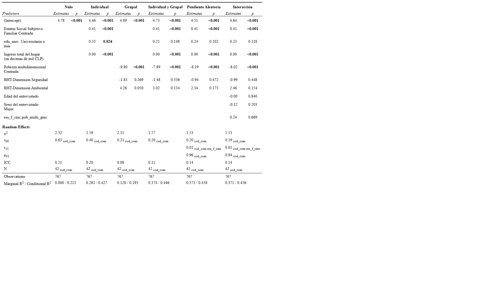

---
format:
  revealjs:
    title-slide: false
    theme: multinivel.scss
    incremental: true 
    slideNumber: true
    auto-stretch: false
    transition: fade
    transition-speed: slow
editor: source
---

# 

```{r datos, echo=FALSE, message=FALSE, warning=FALSE, results='hide'}
pacman::p_load(lme4,
               kableExtra,
               haven,
               car,
               sjmisc,
               sjPlot,
               gt,
               stargazer,,
               webshot2,
               ggplot2, # gráficos
               dplyr, # manipulacion de datos
               equatiomatic) # paquetes a cargar

options(scipen = 999)

data <- readRDS("output/data_proc.Rdata")

# Modelo multinivel: Modelo nulo -------------------------------------------------------

agg_data=data %>% group_by(cod_com) %>% summarise_all(funs(mean)) %>% as.data.frame()

model0 = lmer(ess ~ 1 + (1 | cod_com), data = data)

ICC<-reghelper::ICC(model0)
ICC*100

#Modelo 1: Predictores de nivel individual -------------------------------

model1 = lmer(ess ~ 1 + ess_f_cmc  + edu_univ + inghogar_i_mil + (1 | cod_com), data = data)

# Modelo 2: Predictores nivel 2 -------------------------------------------

model2 = lmer(ess ~ 1 + pob_multi_gmc +  dim_seg  + dim_amb +  (1 | cod_com), data = data)

# Modelo 3: Predictores individuales y grupales ---------------------------

model3 = lmer(ess ~ 1 + ess_f_cmc  + edu_univ  + inghogar_i_mil + pob_multi_gmc + dim_seg  + dim_amb + (1 | cod_com), data = data)

#Modelo 4: Pendiente aleatoria -------------------------------------------

model4= lmer(ess ~ 1 + ess_f_cmc  + edu_univ + inghogar_i_mil + pob_multi_gmc + dim_seg  + dim_amb + (1 + ess_f_cmc| cod_com), data = data)

#Comparación pendiete fija y aleatoria con Anova
anova(model3,model4)

# Modelo 5: Interacción entre niveles -------------------------------------

model5 = lmer(ess ~ 1 + ess_f_cmc  + edu_univ + inghogar_i_mil + ess_f_cmc*pob_multi_gmc  + dim_seg  + dim_amb + edad + sexo + (1 + ess_f_cmc| cod_com), data = data)

```

:::::: columns
::: {.column width="20%"}
:::

:::: {.column .column-right width="80%"}
# **Análisis multinivel del estatus social subjetivo: el caso de la Región Metropolitana**

------------------------------------------------------------------------

**Victoria Arias y Cristóbal Mejías**

::: {.red2 .medium}
**Análisis de datos multinivel - 2025**

**Departamento de Sociología, Universidad de Chile**
:::

Santiago, 19 de Junio de 2025
::::

<https://github.com/multinivel-facso/trabajo1-grupo-6>
::::::

::: notes
Aquí mis notas
:::

# Introducción

-   **Problema de investigación:** La autopercepción del estatus social no se configura únicamente por características individuales, sino también por el entorno en el que se vive. Considerando que los contextos urbanos actuales están marcados por la desigualdad, la Región Metropolitana —caracterizada por su heterogeneidad comunal y altos niveles de desigualdad socioespacial— constituye un escenario pertinente para analizar cómo inciden los factores individuales y comunales en el posicionamiento social subjetivo, a partir del estudio de 42 comunas.

-   **Factores asociados nivel 1:** Nivel educacional, ingresos total del hogar y estatus social subjetivo familiar

-   **Factores asociados nivel 2:** Índice de pobreza multidimensional y dimensión ambiental y de seguridad (MBT) en las comunas de la Región Metropolitana

##  {data-background-color="#821018"}

::: {.center .middle}
[¿Qué factores individuales y comunales inciden en la autopercepción del estatus social subjetivo en la Región Metropolitana?]{style="font-size: 250%;"}
:::

## Hipótesis {.small}

**Nivel 1**

$H_1$: A mayor nivel educativo, mayor será el estatus social subjetivo

$H_2$: A mayores ingresos, mayor es el estatus social subjetivo

$H_3$: Un mayor estatus social subjetivo familiar tiene un efecto positivo sobre el estatus social subjetivo

**Nivel 2**

$H_4$: Las comunas con un mayor índice de pobreza multidimensional niveles más bajo de estatus social subjetivo

$H_5$: Las comunas con una mayor tasa en la dimensión ambiental tienen niveles más elevados de estatus social subjetivo.

$H_6$:Las comunas con una mayor tasa en la dimensión de seguridad tienen niveles mas altos de estatus social subjetivo

**Interacción**

$H_7$: El efecto positivo del estatus social familiar sobre la autopercepción del estatus social subjetivo se reduce en aquellas comunas con un mayor índice de pobreza multidimensional

# Metodología {data-background-color="#821018"}

## Datos

-   La presente investigación utiliza datos provenientes de la encuesta Estudio Longitudinal Social de Chile (ELSOC) del año 2022. Para las variables de nivel 2, se incorporaron dos fuentes adicionales: la primera entrega información comunal sobre el índice de pobreza multidimensional, y la segunda aporta datos sobre las dimensiones ambiental y de seguridad incluidas en la Matriz de Bienestar Territorial.

-   Análisis mediante modelo multinivel de dos niveles:

    Nivel 1: Individuos (n=767)

    Nivel 2: Comunas (n=42)

------------------------------------------------------------------------

```{r mapa,  fig.align="center", fig.width=12, fig.height=8}
library(dplyr)
library(stringr)
library(stringi)
library(ggplot2)
library(sf)

mapa_rm <- st_read(
  "https://raw.githubusercontent.com/caracena/chile-geojson/master/13.geojson",
  quiet = TRUE)

# Data frame de comunas faltantes
comunas_faltantes <- data.frame(
  comuna = c("Pirque", "San José de Maipo", "Tiltil", "Buin",
             "Calera de Tango", "Melipilla", "Alhué", 
             "María Pinto", "San Pedro", "Talagante")
)

# Normalizar (quitar tildes, pasar a mayúsculas)
comunas_faltantes <- comunas_faltantes %>%
  mutate(comuna_norm = str_to_upper(stri_trans_general(comuna, "Latin-ASCII")))

mapa_rm <- mapa_rm %>%
  mutate(Comuna_norm = str_to_upper(stri_trans_general(Comuna, "Latin-ASCII"))) %>%
  mutate(
    estado = if_else(Comuna_norm %in% comunas_faltantes$comuna_norm, "No incluida", "Incluida")
  )

# Mapa
ggplot(mapa_rm) +
  geom_sf(aes(fill = estado), color = "white") +
  scale_fill_manual(
    values = c("Incluida" = "#4CAF50", "No incluida" = "#FF5722"),
    name = "Cobertura comuna"
  ) +
  theme_minimal() +
  labs(
    title = "Mapa de las comunas de la Región Metropolitana consideradas en el analisis"
  )

```

## Variables

```{r tbl_var}

tabla1 <- tibble::tribble(
  ~Tipo, ~Variable, ~Operacionalización, 
  
  "Dependiente", 
  "Estatus social subjetivo", 
  "¿Dónde se ubicaría usted en la escala de estatus social?\n1 (Nivel más bajo) – 10 (Nivel más alto)",
  
  "Nivel 1", 
  "Nivel educacional", 
  "Educación básica incompleta\nEducación básica completa\nEducación media incompleta\nEducación media completa\nEducación superior no universitaria\nEducación universitaria completa",
  
  "",
  "Ingreso total por hogar", "",
  
  "",
  "Estatus social familiar", 
  "¿Dónde ubicaría a la familia en que creció en la escala de estatus social?\n1 (Nivel más bajo) – 10 (Nivel más alto)",
  
  "Nivel 2", 
  "Pobreza multidimensional", 
  "Índice compuesto por las siguientes dimensiones: educación, salud, trabajo, vivienda y redes y cohesion social", 
  
  "",
  "Ambiental",
  "Dimensión basada en la amplitud térmica anual y la cobertura vegetal",
  
  "",
  "Seguridad",
  "Dimensión construida a partir de los indicadores de seguridad que miden la incidencia de delitos graves y leves contra personas y la propiedad",
  
)

tabla1 %>%
  gt() %>%
  tab_header(
    title = md("**Tabla 1: Variables del estudio**")
  ) %>%
  cols_label(
    Tipo = "Nivel de análisis",
    Variable = "Variable",
    Operacionalización = "Operacionalización",
  ) %>%
  tab_style(
    style = cell_text(weight = "bold"),
    locations = cells_body(
      columns = Tipo,
      rows = Tipo != ""
    )
  ) %>%
  tab_options(
    table.font.size = px(13),
    row.striping.include_table_body = TRUE
  )

```

## Descriptivos de nivel 1 {.small}

```{r descriptivos n1}

data %>%  select (ess, ess_f, edu_univ,inghogar_i, inghogar_i_mil) %>% sjmisc::descr(.,
                                                                                                     show = c("label","range", "mean", "sd", "NA.prc", "n"))%>%
  kable(., digits =2, "markdown", caption = "Estadísticos descriptivos de las variables individuales")

```

## Descriptivos Nivel 2 {.small}

```{r descriptivos n2}

data %>%
  select(comuna, pob_multi, dim_amb, dim_seg) %>%
  distinct() %>%
  sjmisc::descr(., show = c("label","range", "mean", "sd", "NA.prc", "n")) %>%
  kable(digits = 2, format = "markdown", caption = "Estadísticos descriptivos de las variables contextuales")

```

## Métodos {.small}

Modelo nulo: modelo sin predictores

$$
ess_{ij} = \gamma_{00} + u_{0j} + r_{ij}
$$

Modelo 1 (individual)

$$
ess_{ij} = \gamma_{00} + 
\gamma_{10} \text{educación universitaria} + 
\gamma_{10} \text{estatus social familiar} +  
\gamma_{10} \text{ingresos} + u_{0j} + r_{ij}
$$

Modelo 2 (Grupal)

$$
ess_{ij} = \gamma_{00} + 
\gamma_{01} \text{pobreza mutidimensional} + 
\gamma_{01} \text{dimension ambiental} + 
\gamma_{01} \text{dimension seguridad} + u_{0j} + r_{ij}
$$

Modelo 3 (Multinivel)

$$
\begin{align*}
ess_{ij} &= \gamma_{00} 
+ \gamma_{10} \text{educación universitaria}_{ij} 
+ \gamma_{10} \text{estatus social familiar}_{ij} 
+ \gamma_{10} \text{ingresos}_{ij} \\
&+ \gamma_{01} \text{pobreza multidimensional}_{j} 
+ \gamma_{01} \text{dimensión ambiental}_{j} 
+ \gamma_{01} \text{dimensión seguridad}_{j} 
+ u_{0j} + r_{ij}
\end{align*}
$$

------------------------------------------------------------------------

Modelo con pendiente aleatoria

$$
\begin{align*}
ess_{ij} &= \gamma_{00} \\
&+ \gamma_{10} \text{estatus social familiar}_{ij} + \gamma_{10} \text{educación universitaria}_{ij} \\
&+ \gamma_{10} \text{ingreso}_{ij} + \gamma_{01} \text{pobreza multidimensional}_{j} \\
&+ \gamma_{01} \text{dimensión seguridad}_{j} + \gamma_{01} \text{dimensión ambiental}_{j} \\
&+ u_{0j} + u_{1j} \text{estatus social familiar}_{ij} + r_{ij}
\end{align*}
$$

Modelo de interacción entre niveles

$$
\begin{align*}
ess_{ij} &= \gamma_{00} \\
&+ \gamma_{10} \, \text{estatus social familiar}_{ij} + \gamma_{10} \, \text{educación universitaria}_{ij} \\
&+ \gamma_{10} \, \text{ingreso}_{ij} + \gamma_{01} \, \text{pobreza multidimensional}_{j} \\
&+ \gamma_{01} \, \text{dimensión seguridad}_{j} + \gamma_{01} \, \text{dimensión ambiental}_{j} \\
&+ \gamma_{11} \, \text{estatus social familiar}_{ij} \, \text{pobreza multidimensional}_{j} + u_{0j} \\
&+ u_{1j} \, \text{estatus social familiar}_{ij} + r_{ij}
\end{align*}
$$

# Resultados {data-background-color="#821018"}

## Descriptivos

## Modelos

Tabla de resumen de los modelos

{width=100% height=100% style="object-fit: contain;"}


## Resultados {.scrollable-x}

resultado del modelo aleatorio


## Interacción

::::: columns
::: {.column width="70%"}

:::

::: {.column width="30%"}
La interacción muestra que...
:::
:::::

# Conclusiones {data-background-color="black"}

::: incremental
-   bla bla bla
-   bla bla
-   bla
:::

## Referencias
